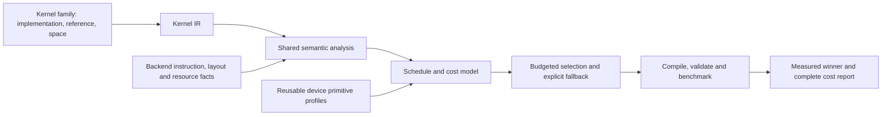

# TileTune alignment with a portable kernel autotuning system

Historical design checkpoint. The repair-study runner and its manifests are now
retired; use the [current experiments](../experiments/README.md) for executable
commands. Original measurement artifacts retain their recorded provenance.

Reviewed 2026-09-15: local working tree based on `bea5d199`, analysis version
21, including the existing uncommitted repairs. This is an architectural and
evidence review. Historical benchmark results describe their recorded source
versions; they are not fresh measurements of this working tree.

## Assessment

**TileTune is aligned with the proposed direction, but its implementation and
validation do not yet establish a complete portable autotuning system.**

The strongest proposed contribution is:

> Derive execution structure from kernel IR, combine it with reusable hardware
> primitive measurements, and select high-performance configurations under a
> small measurement budget without collecting a workload training corpus.

This is a defensible research direction, not an established novelty claim.
Analytical modeling alone does not establish novelty or portability. The paper
needs evidence that the representation, backend contracts, model composition,
and selection policy jointly improve tuning cost and selected-kernel quality.

The useful objective is reliable ranking and low total tuning cost. Perfect
latency prediction is neither necessary for this objective nor supported by
the current model.

## What already supports the direction

- **Analysis consumes actual IR.** The collector reads registered operator
  metadata and access regions; propagation follows required output tiles.
  Family recognition inspects the graph, including the connected GEMM,
  normalization, and GEMM chain in attention. It does not identify kernels by
  benchmark name. See [collector](../tilelang/tiletune/src/collector.py),
  [propagation](../tilelang/tiletune/src/propagation.py), and
  [families](../tilelang/tiletune/families/__init__.py).
- **The model represents mechanisms.** Shared stages estimate live storage,
  logical traffic, residency, operation service, and buffer readiness/reuse.
  Region scheduling handles serial work, independent pipelines, and bounded
  tails. This is a substantive execution model. See
  [engine](../tilelang/tiletune/engine.py),
  [schedule](../tilelang/tiletune/schedule.py), and
  [region scheduling](../tilelang/tiletune/region_schedule.py).
- **Compiler semantics are reused.** The C++ adapters expose registered access
  semantics and the compiler's producer-copy classification. Ampere analysis
  obtains compiler pipeline plans on a separate module. This reduces duplicated
  lowering policy. See [operator adapter](../src/op/operator.cc),
  [copy adapter](../src/cuda/op/copy_analysis.cc), and
  [Ampere preparation](../tilelang/tiletune/ampere.py).
- **Measurements have explicit roles.** Primitive profiles are reusable and
  loading them is offline. Candidate selection precedes candidate compilation
  and timing. Resource violations, user policies, and uncertain estimates have
  separate reporting. The comparison infrastructure records failures, source
  identities, attempted budgets, and independent exhaustive references. See
  [profiling](../tilelang/tiletune/profiling/device_profile.py),
  [runtime](../tilelang/tiletune/runtime.py), and
  [study coordinator](../experiments/suite.py).

These boundaries should survive cleanup.

## Findings, ordered by importance to the paper

### 1. Hardware portability remains partial

Target recognition, compilation, finite model coverage, and measured selection
quality are separate capabilities. The current state is:

| Target | Implemented boundary | Evidence still needed |
| --- | --- | --- |
| Ampere | Native execution, primitive probes, compiler-ordered asynchronous pipeline model | Final evaluation of the repaired model on untouched cases |
| Hopper | Native execution, WGMMA profiles, supported TMA/warp-specialized schedules | Comparable broad-space validation of the current revision |
| Blackwell | Target recognition and ordinary MMA execution/profiling path | TCGEN05/TMEM-specific modeling and runtime evaluation |
| HIP/CDNA | Native execution plumbing, target identity, explicit external profiles, resource counters | Complete instruction/collective/residency modeling and hardware evaluation |
| Ascend | External-worker protocol and explicit model boundary | Worker/backend integration plus Cube/Vector and storage/scheduling model |

This follows the [documented hardware matrix](../experiments/common/README.md)
and the source: automatic [primitive profiling](../tilelang/tiletune/profiling/device_profile.py)
currently requires CUDA; automatic reduction-layout prediction in
[compute.py](../tilelang/tiletune/compute.py) uses MMA/WGMMA helpers; HIP
[occupancy](../tilelang/tiletune/occupancy.py) omits scalar-register constraints
and per-SIMD allocation granularity. Ascend has no native model in
[targets.py](../tilelang/tiletune/targets.py).

Changing bandwidth and core count is insufficient when instruction ownership,
resource allocation, and synchronization differ. A portable shared
representation should allow different backend execution models. Portability
does not require identical equations or legal schedules on every device.

### 2. Precise profiles cannot compensate for missing mechanisms

[Global-memory analysis](../tilelang/tiletune/global_memory.py) explicitly
counts logical tile bytes without transaction/coalescing or inter-block cache
modeling. [Occupancy](../tilelang/tiletune/occupancy.py) generally uses logical
tile storage as a proxy for physical register allocation. Compiler scratch,
allocation granularity, and spill service remain incomplete.
[Pipeline timing](../tilelang/tiletune/pipeline.py) divides modeled shared
throughput among resident CTAs. These are structural assumptions, not merely
imprecisely measured rates.

For example, two configurations can have similar logical work but different
transaction efficiency or reuse. A more accurate single byte-service rate
cannot represent an omitted configuration-dependent difference. The optional
global latency anchor also cannot repair ranking: it multiplies every score by
the same positive number.

The [repair diagnosis](tiletune_expanded_repair_implementation.md) reports
repeated GEMM ranking inversions. Changing the memory regime improved the
development shortlist but retained the investigated inversions. This does not
isolate their physical cause.

Prioritize mechanisms whose omission demonstrably changes the shortlist. Use
controlled diagnostics to distinguish memory transactions/reuse, instruction
service, and residency before changing formulas. A comprehensive simulator is
not a prerequisite for a useful autotuner, but unsupported effects need explicit
coverage and uncertainty treatment.

### 3. Model coverage and ranking quality need separate validation

The latest archived repair replay on the **development pool** reports:

| Family | Correct configurations with finite scores | Coverage |
| --- | --- | --- |
| GEMM | 1,718 / 1,904 | 90.2% |
| Causal attention | 617 / 737 | 83.7% |
| Chunk-output KDA | 3,260 / 3,260 | 100% |
| Softmax | 313 / 409 | 76.5% |

Source: [coverage replay](../experiments/results/expanded-repair-implementation-20260915/coverage-final-v2-summary.json).
The KDA and reduction repairs are meaningful improvements over the original
pilot. Remaining unknowns include allocation uncertainty and unresolved
residency. Finite coverage does not establish good ordering: the repaired
development GEMM Oracle@20 remains about 80.4% with the primary streaming
profile, and the original winner ranks 312th. These are development diagnostics,
not final generalization results.

At inspection time, the three-seed study had neither a completed
`study.json` nor `all-selections-frozen.json`; the seed-123 comparison
contained three cases. Do not infer final repaired-model performance from
partial files or promote development replays to held-out results.

### 4. The selector is a valid one-shot autotuner, with important system limits

[TileTuneSession.prepare_top_k](../tilelang/tiletune/runtime.py) analyzes the
entire supplied grid, sorts finite eligible scores, and freezes K candidates.
Measured latencies are recorded but do not update subsequent selections.
Exploration is optional and draws from permitted unknown-cost candidates.
It does not diversify incorrectly ranked finite-score candidates.

This is a legitimate autotuning strategy. An adaptive learned model is not
required. However, the full system must define:

- How supported kernel implementations expose meaningful configuration spaces.
- How analysis cost fits within the user's tuning budget.
- What happens when a model is unavailable or most configurations are unscored.
- Whether any exploration budget also addresses uncertainty within the scored set.

The public tuner currently raises when top-K produces no eligible selection.
An explicit fallback policy would improve system usability while preserving
the pure-model experimental baseline. Any new policy needs separate evaluation;
the current development exploration results do not establish an improvement.

### 5. CPU cost is part of the research problem

Every candidate is elaborated and analyzed before selection; the public
preparation loop is sequential. Some candidates require compiler planning,
layout verification, symbolic domain analysis, and report construction.

The repaired 409-configuration softmax selection took **128.6 seconds** in the
archived fresh-process, single-core comparison, down from 277.4 seconds with
identical outputs. This is useful progress, but a substantial cost for a
selector. Source: [CPU comparison](../experiments/results/expanded-repair-implementation-20260915/cpu-full-selection-comparison.json).
Separate parallel coverage runs have different scopes; their timings should
not be substituted for complete selection wall time.

Report both:

```text
first use = device/workload preparation + selection + compile/check/measure
later use = amortized preparation + fresh selection + compile/check/measure
```

The [frozen pilot](tiletune_config_space_implementation.md) demonstrates the
tradeoff: XGBoost had expensive label collection but much cheaper online
selection. Neither method wins on preparation cost alone.

### 6. Code organization is understandable, but important boundaries leak

The shared analysis stages and small native adapters are good foundations.
The concrete cleanup targets are:

1. **Backend facts:** `engine.py` explicitly dispatches Ampere preparation;
   `compute.py` imports CUDA layout helpers; `shared_memory.py` and
   `region_schedule.py` consume `ampere_plans`; region timing calls the Ampere
   scheduler. Move these behind a small backend interface for instruction,
   layout, resource, and schedule facts, driven by an actual second backend.
2. **Scheduling results:** `pipeline.py` first runs the single-loop path, then
   replaces selected errors by matching their human-readable strings when
   region scheduling succeeds. Use structured diagnostic codes and explicit
   supported/fallback states. A shared schedule representation could retain a
   fast path for a single loop without duplicating semantic decisions.
3. **Experiment ownership:** kernel builders, configuration axes, and legality
   rules are spread across `portable/kernels.py`, `kernels_expanded.py`,
   `spec.py`, and `spaces.py`. Put family implementations, references, spaces,
   and cases beside their existing GEMM/attention/KDA/vector experiments.
   Keep portable coordination, worker protocol, budgets, and result aggregation
   shared. Preserve stable configuration identities during migration.
4. **Current documentation:** the package README still describes analysis
   version 17 as unchanged, while `config.py` reports version 21. Publish one
   current source/capability guide and label historical design and evaluation
   documents by version.

Small typed records at backend and stage boundaries would help; the existing
region/operation dataclasses are a starting point. There is no need to turn
every dictionary into a class or introduce a large plugin framework.

## Recommended system boundary



Backend-specific models are expected. The shared semantic representation and
autotuning protocol are what make those implementations one system.

## Implementation and evaluation order

1. **State the claim and support scope.** Define which instruction/schedule
   families are supported on each target. Select at least one real non-NVIDIA
   backend if the paper claims vendor portability. Report each capability
   separately; an external-worker interface is not runtime validation.
2. **Stabilize semantic and backend boundaries.** Preserve existing outputs
   while moving backend facts and family experiment definitions to their owners.
   Introduce structured diagnostic categories where control flow needs them.
3. **Address demonstrated ranking and cost bottlenecks.** Diagnose GEMM service
   errors and allocation uncertainty; reduce repeated analysis and unnecessary
   report work. Measure fresh complete selection cost, even when reusable
   structural facts or profiles are available.
4. **Validate transfer and usefulness.** Freeze the model before new shapes,
   alternate implementations, and new-target evaluation. Use identical attempted
   trial budgets and failure accounting. Compare random selection, a cheap
   analytical baseline, an applicable prior analytical tuner, XGBoost, and the
   full model. Include component ablations, score/winner coverage, top-K quality,
   bad-case behavior, and first-use/amortized wall time.

Keep fast semantic checks separate from cross-compilation checks and scheduled
hardware performance studies. A compact suite can cover GEMM, attention,
multi-region KDA, and streamed reductions with aligned and tail shapes; broad
performance claims still require a larger frozen hardware/workload matrix.

## Verification in this review

Reviewed the analysis, scheduling, resource, profiling, target, selection,
native-adapter, and experiment paths above. Ran existing TileTune tests plus
configuration-space, comparison, study-coordination, and XGBoost tests with GPU
visibility disabled. Device integration tests were excluded, and the Blackwell
cross-compile test was deselected because the installed CUDA toolkit is 12.4.

Initial result: **391 passed, 29 skipped, one deselected, three failed**. Two
failures needed explicit `CUDA_HOME`; the third needed an explicit TVM target
for a mocked decorator test with GPUs hidden. Targeted reruns passed all three
using CUDA 12.4/GCC 10 and an explicit `sm_80` target as appropriate. Thus all
394 executed test cases passed after supplying their environment prerequisites.
The two Ampere probe tests cross-compiled kernels but did not execute them.

No fresh GPU performance measurements were made. This review added only this
document and did not change the existing implementation or experiment records.
