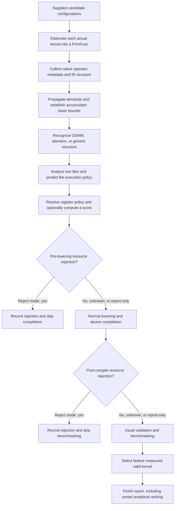

# TileTune: from PrimFunc to filtering, timing estimates, and benchmarking

This document describes `ANALYSIS_VERSION = 17` and device `PROFILE_VERSION = 4`.
It explains the current implementation, including the differences between GEMM
and attention. Source links identify the implementation behind each part of the
process.

The [code review guide](../tilelang/tiletune/README.md) maps the source into
shared analysis stages and separate GEMM/attention policy modules. The source
reorganization preserves the analysis described here.

## 1. What TileTune does

TileTune analyzes each candidate's **actual, elaborated TileLang PrimFunc**.
It obtains operations, buffer regions, data types, loops, and launch information
from that IR and TileLang's native operator metadata. It then derives register
demand, predicts a supported execution policy, estimates memory and computation
costs, and optionally assigns a ranking score.

That native connection is central: TileTune does not reconstruct a hypothetical
kernel from a dictionary such as `block_M=128, block_N=128`. The dictionary is
used to elaborate the real kernel; analysis reads what the resulting kernel
actually contains. Buffer names are for reporting, while buffer identity and
operator metadata determine dependencies and roles.

There are three important qualifications to the sequence “recognize, filter,
rank, then benchmark”:

1. **GEMM and attention use the same analysis modules.** Family recognition
   supplies graph roles, the main loop, phase labels, and a family-specific
   memory-accounting choice. It does not select two independent cost models.
2. **Top-K selection is explicit.** With `top_k=None`, successful candidates
   surviving resource checks are benchmarked through the usual tuner. A positive
   `top_k` adds a full-grid analysis pass before compilation, freezes the first K
   finite eligible scores, and reuses selected PrimFuncs. Unselected candidates
   remain in the report; compilation and benchmark failures never refill K.
3. **`pipeline_time` is optional.** The default metric is `traffic_waves`.
   Pipeline timing requires an explicitly supplied performance profile and a
   supported schedule. Missing timing information does not silently fall back
   to a traffic score.

The current autotuner integration requires CUDA with the `tvm_ffi` backend,
the standard analyzable JIT path, and `early_stop=False`. It cannot be enabled
alongside the legacy autotune filter system.

Sources: [configuration](../tilelang/tiletune/config.py),
[module orchestration](../tilelang/tiletune/engine.py),
[tuner integration](../tilelang/autotuner/tuner.py#L1336),
[session reporting](../tilelang/tiletune/runtime.py#L171).



Compilation and benchmarking can fail independently of either resource gate.
`report_only` keeps candidates through TileTune's gates; it does not turn a
compiler error or a failed correctness check into a successful candidate.

## 2. Elaboration: where the PrimFunc comes from

For each configuration, the normal TileLang Python frontend binds the workload
and tuning parameters and produces a `tvm.tirx.PrimFunc`. This is before tile
operations are lowered to CUDA instructions.

For example, the FP8 analysis example calls the real GEMM implementation's
`matmul.get_tir(...)`. The attention example calls
`flashattn.jit_impl.get_tir(...)`. Neither needs to compile every candidate to
obtain its PrimFunc.

At this point, the IR still exposes useful structure:

- Parameters and their buffers through `func.buffer_map`.
- Allocated shared buffers and local fragments, including shape and dtype.
- Tile calls such as GEMM, copy, fill, and reduction.
- Scalar expressions, loads, stores, and parallel tile loops.
- The K/key-block loop and its `num_stages` annotation when present.
- Grid dimensions, thread dimensions, explicit layouts, and pass attributes.

In the integrated path, `TileTuneSession.elaborate()` times elaboration and analysis
separately. The compiler receives the resulting program without an analysis
rewrite. Grouped compilation can subsequently assign a unique global symbol
and apply its normal lowering passes.

Sources: [GEMM elaboration example](../examples/gemm_fp8/example_gemm_fp8_tiletune.py#L34),
[attention elaboration example](../examples/flash_attention/example_mha_tiletune.py#L38),
[session elaboration](../tilelang/tiletune/runtime.py#L115),
[grouped compilation](../tilelang/autotuner/grouped_compile.py#L61).

## 3. How information is captured from the PrimFunc

### 3.1 Native tile-operator parsing

`analyze_prim_func()` creates an `_Collector` for the PrimFunc. When the collector
encounters an `Evaluate(Call(...))`, it calls two native FFI functions:

```text
tl.tiletune.ParseOperator(call, enclosing_block_annotations)
tl.tiletune.GetAccessRegions(tile_operator)
```

`ParseOperator` uses TileLang's registered `TLOpBuilder` attribute to reconstruct
the corresponding native `TileOperator` from the call's arguments and
annotations. Registered block-annotation handling is applied as well.
`GetAccessRegions` returns that operator's read and write `BufferRegion` arrays.

The operator object also exposes reflected fields to Python:

| Operator | Examples of captured metadata | Why it matters |
|---|---|---|
| GEMM | `a`, `b`, `c`, `aRegion`, `bRegion`, `cRegion`, `transA`, `transB`, `clearAccum`, instruction/warp policy | Identifies operand roles, reduction extent, accumulator demand, and instruction selection |
| Copy | Source/destination buffers, ranges, annotations | Identifies global/shared/local movement and the exact tile being transferred |
| Reduction | Source/destination regions, axis, reduction kind, `clear` | Identifies sum/max work and whether old destination state is read |
| Other registered tile operations | Their native access regions and available reflected fields | Provides dependencies; detailed cost support still depends on the operation |

Access semantics are important. For a GEMM with accumulation enabled, the native
operator reports reads of A, B, **and C**, plus a write to C. With
`clearAccum=1`, the old C value is not reported as a read. Similarly, a reduction
with `clear=False` reads its previous destination value.

These queries reuse compiler-owned operator semantics. They do not run a
lowering pass, emit CUDA, or measure the candidate.

Sources: [collector](../tilelang/tiletune/analysis.py#L91),
[native registry lookup and FFI adapters](../src/op/operator.cc#L38),
[base access-region interface](../src/op/operator.h#L171),
[GEMM reflection](../src/op/gemm.h#L132),
[GEMM access semantics](../src/op/gemm.cc#L145),
[reduction access semantics](../src/op/reduce.cc#L105).

### 3.2 Scalar operations and structural context

Not every operation is a tile call. For a `BufferStore`, the collector examines
the expression tree, collects its `BufferLoad` inputs, records its destination,
and labels it `elementwise`. This is how it sees attention's exponential,
normalization, rescaling, and masking expressions.

During traversal, it also records:

| IR structure | Information retained |
|---|---|
| `For` | Variable, minimum, extent, loop kind, pipeline annotations |
| Thread-bound loops / `thread_extent` | `blockIdx.*` and `threadIdx.*` extents; active launch domain per operation |
| `SBlock` | Allocated buffers, block annotations, explicit `layout_map` |
| `IfThenElse` | Predicates and mutually exclusive branch identities |
| Pure `Bind` | Substitution of resolved index expressions in the analysis view |
| Buffer references | Buffer identity, scope, dtype, symbolic offsets and extents |

A data-dependent binding, unresolved alias, or opaque call is recorded as
unknown. Registered call-effect metadata helps distinguish pure expressions
from calls whose effects cannot be analyzed. Unknown information is retained
in the report rather than interpreted as zero work.

Each collected `Operation` holds its reads, writes, native metadata, loop
context, predicates, dependencies, launch threads, and pipeline-stage context.
The original PrimFunc is preserved.

Source: [operation records and traversal](../tilelang/tiletune/analysis.py#L62).

### 3.3 Dependencies and backward demand propagation

The collector constructs producer dependencies by matching reads against earlier
writes to the **same buffer** with overlapping regions. Opposite branches of
the same conditional are treated as mutually exclusive. Earlier writers are
discarded only when an unconditional complete overwrite is established under
the supported rules.

The kernel analyzer captures global output writes through `_kernel_outputs()`
and passes these explicit roots to `_propagate_tiles()`, which walks operations
backward. A kernel without captured global writes raises an error. For each demanded output region, it identifies the input regions
needed to produce it:

- **Copy:** translate the demanded destination coordinates back to source
  coordinates. Unit batch/head axes can be preserved when copying a tensor
  slice into a lower-rank shared tile.
- **GEMM:** a demanded C subrectangle selects the corresponding A rows and B
  columns, while retaining the operator's reduction dimension. Transpose flags
  determine the relevant axes. Old accumulator demand is retained when needed.
- **Reduction:** retain the complete reduced axis and restrict the other axes
  according to the demanded output.
- **Elementwise:** use supported separable stores and TVM arithmetic bounds to
  map the demanded output to its scalar input accesses.

Partial overwrites subtract known rectangles from the outstanding demand.
Conditional writes retain possible reaching versions. Unresolved geometry can
produce conservative bounding regions.

For a simple GEMM, the dependency chain is:

```text
global C tile
    <- local accumulator tile
    <- GEMM(A_shared tile, B_shared tile, previous accumulator)
    <- global A tile and global B tile for the K iteration
```

The analysis keeps **tile demand** separate from **coverage over a loop**.
Repeated K iterations multiply traffic and computation, but do not multiply
the simultaneously resident accumulator by the number of iterations.

`analyze_prim_func()` performs one CTA tile propagation. The same demands supply
accumulator proof evidence, memory analysis and the `tile_propagation` report.
Launch coordinates remain symbolic; loop coverage is a derived summary within
the CTA. There is no second propagation or scope switch. The analyzer has no
output override. Separate dependency queries use the same tile algorithm through
`propagate_inputs(func, outputs)`, which requires explicit, nonempty region roots
and does not run pressure or timing analysis.

The public boundary resolves configuration and effective pass settings once.
Internal stages receive this resolved context and do not catch unexpected errors
to fabricate partial reports. Standalone callers receive the exception; the
autotuner records `analysis_failed` and stops that candidate before lowering.
Supported unknown cases still produce explicit model uncertainty. For example,
an unresolved thread count cannot justify a numeric register bound.

Sources: [input mapping](../tilelang/tiletune/analysis.py#L377),
[propagation](../tilelang/tiletune/analysis.py#L490),
[analysis entry point](../tilelang/tiletune/analysis.py#L549).

## 4. Family recognition and execution-policy prediction are separate

`families/` identifies **what computation the graph contains**; the former
`specializations.py` module now provides compatibility imports.
`warp_specialization.py` predicts **a supported compiler execution policy**.

| Family | Recognition rule | Information supplied to common modules |
|---|---|---|
| GEMM | One reflected dense GEMM operation, excluding `tcgen05` | A/B/accumulator roles; a unique enclosing tile loop if recognized; GEMM phase labels |
| Attention | Two dense GEMMs in one common tile loop, connected through derived score data, max/sum reductions, and exp/exp2; the derived data feeds the second GEMM's A operand | Q/K/scores/probabilities/V/output roles; QK, softmax/rescale, and PV phase labels; actual-access memory accounting |
| Generic | No selected family pattern | Common analysis where inputs are available; no recognized family main loop |

The selector tries attention, then GEMM. Recognizing a GEMM does not guarantee a
supported pipeline: the operation can match while its enclosing loop remains
unresolved. A requested family that does not match yields an unknown score.

GEMM and attention both run tile-liveness analysis, WS prediction, register
policy, memory accounting, occupancy, pipeline analysis, and metric selection.
The proven accumulator analysis starts before family selection; its evidence
comes directly from supported operations.

Sources: [GEMM family](../tilelang/tiletune/families/gemm.py),
[attention family](../tilelang/tiletune/families/attention.py),
[common execution order](../tilelang/tiletune/engine.py).

### Supported Hopper WS prediction

The current predictor requires a supported automatic pure-TMA producer path:
Hopper `sm_90`/`sm_90a`, WS enabled, one positive-stage pipeline, supported
control flow, one thread domain, and compatible automatic layouts. It queries
`tl.tiletune.ClassifyProducerCopy`, which uses the compiler's copy classifier.
Every modeled producer must be a supported global-to-shared TMA copy.

For GEMM, the modeled main-loop consumers are GEMM calls. For attention, the
predictor additionally permits supported internal reductions, fills, copies,
and elementwise work. Manual WS, mixed copy mechanisms, and unresolved layouts
or control flow remain outside this prediction.

For the supported default partitions:

| Original consumer threads | Added producer threads | Producer registers/thread | Consumer registers/thread | Predicted CTA reservation |
|---:|---:|---:|---:|---:|
| 128 | 128 | 24 | 240 | 33,792 registers |
| 256 | 128 | 24 | 240 | 64,512 registers |
| 384 | 128 | 24 | 160 | 64,512 registers |

All register quantities use 32-bit register units. These are policy requests,
not PTXAS measurements. They do not scale with pipeline depth.

The profiling API now supports A100 `sm_80` as well as Hopper, but the automatic
WS predictor remains Hopper-specific. A recognized stage-zero serial loop can
use serial timing with an appropriate profile. Positive-stage non-WS pipelines
are not assigned an overlapping timing model by the current implementation.

Sources: [WS predictor](../tilelang/tiletune/warp_specialization.py),
[native copy classification adapter](../src/cuda/op/copy_analysis.cc#L859),
[device-profile targets](../tilelang/tiletune/device_profile.py#L24).

## 5. Register analysis: demand, reservation, and rejection

“Register pressure test” covers three different quantities. Keeping them
separate is necessary to understand what can reject a candidate.

| Quantity | Origin | Use |
|---|---|---|
| Proven accumulator lower bound | Required dense accumulator reads and output demand in the IR | Can justify pre-lowering demand rejection |
| Conservative peak live-tile estimate | Buffer shapes, dtypes, replication, and estimated lifetimes | Determines whether a score is supported; is an occupancy proxy when physical allocation is unknown |
| Predicted physical reservation | Supported producer/consumer register policy | Register-capacity check and WS residency estimate |

### 5.1 Proven accumulator lower bound

The analyzer requires a supported dense GEMM, no relevant unknown/conditional
evidence, a full read of its `local.fragment` accumulator, and propagated demand
covering that full accumulator. A large allocation alone is insufficient.

For an accumulator with `E` elements, element bit width `b`, dtype lanes `v`,
modeled replication `r`, and at most `T` owning threads:

```text
accumulator_registers_per_CTA = ceil(E * b * v * r / 32)
lower_bound_per_thread       = ceil(E * b * v * r / (32 * T))
```

For automatic layouts, all original launch threads provide an upper bound on
the number of accumulator owners, and replication is conservatively ignored
for this lower bound. At least one thread must own at least the average amount;
the proof does not assume every thread owns exactly the average. Added WS
producer threads do not reduce the accumulator's per-consumer demand.

For explicit layouts, the analyzer requires a consistent, invertible mapping
and accounts for replication. Across separate operations it takes the maximum
established bound; it does not add all GEMMs' accumulators into a new proof.

For a fully demanded FP32 GEMM accumulator, without replication:

```text
lower_bound_per_thread = ceil(BM * BN / T)
```

Example: a 128×128 accumulator over 128 original threads gives a lower bound
of 128 registers/thread. A 256×256 accumulator over 128 threads gives 512.
Neither `BK`, the K-iteration count, nor `num_stages` multiplies this bound.

Sources: [initial register-analysis flow](../tilelang/tiletune/register_pressure.py),
[accumulator evidence, ownership and lower bound](../tilelang/tiletune/register_accumulator.py).

Allocation descriptions are separate in
[register_storage.py](../tilelang/tiletune/register_storage.py). Their size and
layout estimates do not prove simultaneous demand. Tile liveness is analyzed
once after family recognition, as described below, covering explicit and
automatic fragments as well as thread-private allocations and loop-carried state.

### 5.2 Conservative live-tile demand

`analyze_live_tiles()` estimates which local fragments and thread-private
allocations coexist at each operation. It accounts for dtype packing, explicit
replication where available, and values whose first loop use reads state that
is also updated in the loop.

For phase `p`, the aggregate estimate is:

```text
live_registers[p] = ceil(sum(modeled_live_bits[p]) / 32)
peak_tile_registers = max_p(live_registers[p])
demand_estimate_per_consumer = ceil(peak_tile_registers / consumer_threads)
```

This may overestimate storage because the compiler can reuse or eliminate
values. It also omits some compiler temporaries. It is not an exact total
register count, nor an independent proof that the kernel must spill.

Source: [live-tile analysis](../tilelang/tiletune/liveness.py).

### 5.3 Policy and the actual pre-lowering decision

The base per-thread capacity comes from the known architecture limit, optionally
tightened by `register_cap`. For a known WS policy, the consumer request can
tighten that capacity further.

```text
physical_reservation = producer_threads * producer_request
                     + consumer_threads * consumer_request

allowance = attention_spill_budget_registers_per_thread
            for a matched attention family; otherwise 0

demand_limit = effective_per_thread_capacity + allowance
```

The final pre-lowering policy can reject when:

1. A resolved policy reservation exceeds registers available per SM.
2. A resolved producer/consumer request exceeds the hardware per-thread cap.
3. The proven accumulator lower bound exceeds `demand_limit`.

If only the **estimated** live demand exceeds the allowance, ranking becomes
unknown; that estimate alone does not add a rejection. If a score relies on
the allowance, the report labels it conditional and states that spill traffic
is not modeled.

The attention allowance defaults to zero in `TileTuneConfig`. The attention
example explicitly uses 32. It does not enlarge the SM register file or change
the physical residency calculation. It also does not override post-compile
spill/local-memory limits; those are separate settings.

The engine replaces the preliminary pressure-only decision with this final
register-policy decision. `TileTuneSession` then enforces it in `reject` mode.
`report_only` records `would_reject` but continues.

Sources: [architecture/user budget](../tilelang/tiletune/budget.py),
[register policy](../tilelang/tiletune/register_policy.py),
[decision enforcement](../tilelang/tiletune/runtime.py#L123).

### GEMM versus attention pressure

For GEMM, the dominant logical state is usually its C accumulator. Other
fragments and local temporaries can contribute to estimated peak liveness.

For attention, the QK score accumulator and the output accumulator can coexist,
along with probability casts, running maxima, sums, and rescale values. The
output accumulator and online normalization state persist across key-block
iterations. The liveness analysis includes this overlap.

For example, with `BM=BN=head_dim=128`, FP32 accumulation, and 256 consumers,
each 128×128 accumulator alone gives a 64-register/thread lower bound if the
full-read evidence is established. Their overlapping storage, cast fragments,
and row state can make the estimated demand much larger. The code does not
promote that entire estimated sum into a proven rejection bound.

Both families use the same physical WS reservation formula. With 256 consumers,
the default reservation is 64,512 registers regardless of whether those
consumers execute GEMM alone or GEMM plus softmax.

## 6. Memory accounting and occupancy

### 6.1 Logical global-memory traffic

The memory analyzer multiplies each external tile's bytes by its loop visits.
The bytes include dtype packing. It distinguishes inputs loaded once from
inputs loaded inside the recognized main loop.

For a regular GEMM with aligned dimensions, no extra inputs, and one output
store:

```text
n = ceil(K / BK)
input_bytes_per_iteration = BM * BK * sizeof(A) + BK * BN * sizeof(B)
traffic_bytes_per_CTA = n * input_bytes_per_iteration + BM * BN * sizeof(output)
```

Actual code uses the captured regions and their bounds, including transpose
and edge handling, rather than substituting this formula for every kernel.

For attention, the specialization counts **actual external accesses per
operation**, avoiding duplicated charges when backward propagation reaches the
same Q/state through multiple dependency paths. In the current forward example:

```text
Q: loaded once per query CTA
K, V: loaded once each per key-block iteration
scores/probabilities: internal tiles, not global traffic
output: written after the loop
```

These are logical bytes. The model does not derive cache hit rates, memory
transaction efficiency, or coalescing from them. A cached or streaming profile
is selected explicitly.

Source: [memory analysis](../tilelang/tiletune/memory.py).

### 6.2 Shared storage

Shared buffers written inside a pipeline receive modeled stage copies. Buffers
outside it do not automatically receive that multiplier. For example, in the
attention kernel, K/V buffers are staged; Q and the output staging buffer are
not both multiplied by the key-loop depth.

The current implementation also predicts reuse between disjoint shared-buffer
lifetimes. A whole repeated loop is treated as an overlapping lifetime region,
so it does not incorrectly reuse A/B or K/V storage merely because their
lexical accesses occur at different points in the loop.

It reports both the sum of allocation sizes and an estimated shared-memory
arena size. Occupancy uses the arena estimate. Unknown access information or
disabled shared-memory reuse falls back to the sum. Padding, alignment, and
compiler-generated storage remain limitations; this estimate cannot reject a
candidate by itself.

Source: [shared-storage planning](../tilelang/tiletune/shared_storage.py).

### 6.3 Resident CTAs and grid waves

The occupancy calculation combines register, shared-memory, thread, and block
limits. Thread count includes added producer threads for a predicted WS kernel.

```text
resident_CTAs_per_SM = min(register_bound,
                          shared_memory_bound,
                          thread_bound,
                          hardware_block_bound)

waves = ceil(grid_CTAs / (resident_CTAs_per_SM * SM_count))
```

For predicted WS, the register bound uses the physical policy reservation,
independently of logical tile demand. For other paths, the maximum of the
accumulator and live-tile estimates is only a proxy for unknown allocation.

On an SM with 65,536 registers, each default WS reservation in Section 4 permits
at most one resident CTA by this calculation. That follows from these specific
budgets, not from a general rule that all WS kernels have one CTA per SM.

Missing capacities, unresolved domains, or estimated block resources exceeding
device limits leave the wave estimate unknown. Such occupancy uncertainty is
distinct from the proven register-policy rejection described above.

Sources: [occupancy and waves](../tilelang/tiletune/waves.py),
[device-limit queries](../tilelang/tiletune/cost.py#L21).

## 7. Where the performance-model costs come from

`analyze_prim_func()` does not benchmark the candidate to obtain its score.
The caller supplies `performance_model`. The reusable `profile_device()` API
can produce it by compiling and measuring fixed primitive kernels, then caching
the results by device/build/dtype identity. `load_device_profile()` reads an
existing profile without launching kernels.

| Model input | Origin |
|---|---|
| Tile bytes, FLOPs, loop counts, stage count | Calculated from actual IR regions and operations |
| Consumer threads, selected MMA/WGMMA instruction | IR thread domain plus compiler instruction-selection helper |
| Producer partition and register requests | Prediction of the supported compiler WS policy |
| SM count and physical capacities | Device query or explicitly supplied limits; target register caps also use an architecture table |
| Global/shared/scalar/exp/reduction throughput | Fixed primitive microbenchmarks, normalized to effective rates |
| GEMM throughput | Fixed shared-resident 64×128×128 GEMM probes, with paired iteration counts |
| WGMMA throughput per warpgroup | Separate one-CTA, 128-thread GEMM probe on Hopper |
| Primitive throughput at a given consumer count | One-CTA probes at 32, 64, 128, 256, and 512 threads, using eight independent chains |
| Barrier cost | Device-clock measurement of repeated barriers |
| Copy latency | Residual of a copy-plus-dependent-consumer probe after subtracting modeled byte service and barrier cost |
| `latency_scale` | Optional calibration from one measured reference latency |

Paired sizes/iteration counts reduce fixed setup effects. Rates still include
probe-specific instruction dependencies and overhead; they are not hardware
peak specifications. Copy latency is especially an effective residual rather
than an isolated instruction-latency measurement.

Profiles distinguish target, instruction, input/accumulator dtypes, and memory
regime. The analyzer checks relevant signatures. A common profile can serve
GEMM and attention because attention uses the same matrix and scalar
primitives, but this does not guarantee prediction accuracy for every shape.

A positive global `latency_scale` changes the reported time scale, not the
ordering of candidates scored with the same profile.

Sources: [profile construction and caching](../tilelang/tiletune/device_profile.py),
[primitive kernels](../tilelang/tiletune/device_probes.py).

## 8. How `pipeline_time` is calculated now

The current model has three levels: operation service times, a repeated
producer/consumer buffer schedule, and a launch-wide CTA schedule.

### 8.1 Service time of each operation

Let:

```text
q = min(resident_CTAs_per_SM, ceil(grid_CTAs / SM_count))
```

`q` is the model's representative number of competing CTAs per SM. It is
calculated from occupancy and grid size, not measured. It caps sharing by both
resource residency and available grid work; a partial last wave is not a
measurement of identical occupancy on every SM.

For work amount `W` and aggregate per-SM rate `R`:

```text
aggregate_service = W * q / R
```

If a profile includes a single-CTA rate for the relevant consumer count, scalar,
exp, and mapped reduction service additionally obey:

```text
service = max(W * q / aggregate_SM_rate,
              W / single_CTA_rate[consumer_threads])
```

Producer threads do not increase that consumer count. A missing required row
or primitive rate yields unknown timing rather than an interpolated rate.

For a GEMM phase:

```text
GEMM_service = max(FLOPs * q / GEMM_SM_rate,
                   shared_operand_bytes * q / shared_SM_rate,
                   FLOPs / (consumer_warpgroups * WGMMA_group_rate))
```

The third limit is optional and applies to WGMMA. Scalar, exponential, and
reduction work is added in program order. A mixed expression's scalar work and
its exponential work are both counted. These operation-count conventions are
heuristics; they do not reproduce every generated instruction.

For reductions, the current code does more than divide logical reduced elements
by one rate. It obtains explicit fragment ownership or calls a compiler
MMA/WGMMA layout helper to predict ownership. It counts local combine pairs and
warp-shuffle/combine pairs separately, then uses the matching sum/max rates.
Unsupported inter-warp collectives remain unknown. These layout helper queries
create analysis values; they do not run a layout-inference pass on the PrimFunc.

Sources: [operation work](../tilelang/tiletune/operation_work.py),
[service-time calculation](../tilelang/tiletune/service.py),
[reduction mapping and work](../tilelang/tiletune/reduction.py).

### 8.2 Individual producer buffers and their consumers

For each global-to-shared producer copy in the loop, the analyzer captures:

```text
copy operation, destination buffer/region, bytes,
first consuming operation, last consuming operation
```

It requires supported single-writer buffer use. Multiple producer writes to the
same buffer, conditional copies, or unresolved overwrites need a richer
region-level model and currently leave this schedule unknown.

The scheduler tracks a ring of `D = max(1, num_stages)` slots for each producer
buffer, with modeled depths from 1 to 32. Its state contains the previous
consumer completion, producer issue time, byte-service completion, and the
release times of all buffer slots.

The recurrence is equivalent to the following timing rules, with all state
initially available at time zero:

```text
For each producer copy j, in captured order:
    issue = max(issue, release_time_of_reused_slot[j])
    byte_service_end = max(byte_service_end, issue) + bytes[j] * q / global_rate
    ready[j] = byte_service_end + copy_latency

For each consumer operation p, in captured order:
    newly_required = buffers whose first consumer is p
    consumer_end = max(previous_consumer_end, ready[newly_required])
                   + operation_service[p]
                   + len(newly_required) * barrier_cost
    buffers whose last consumer is p become reusable at consumer_end

Advance each buffer's ring of release times and repeat for the next iteration.
```

This lets a consumer wait only for the inputs it actually needs, while producer
prefetch is limited by buffer reuse. Byte service is modeled in FIFO order and
consumer phases are serialized. Producer instruction issue overhead and actual
CUDA instruction scheduling are not simulated.

The implementation expresses these max/add dependencies as a transition matrix
and repeats it using exponentiation. It does not unroll every K iteration;
the number of transition-composition steps grows logarithmically with the
iteration count.

**The older formula**

```text
interval = max(copy_service, consumer, (copy_ready + consumer) / buffer_depth)
```

**is not the current overlapping-pipeline implementation.** It is a useful
earlier aggregate approximation. Current overlapping timing comes from the
individual buffer recurrence. Reported `steady_state_interval_cycles` is the
difference between the modeled completion at `n` and `n-1` iterations; it is not
an independently profiled constant or necessarily an asymptotic limit.

Source: [buffer collection and recurrence](../tilelang/tiletune/tile_schedule.py).

### 8.3 Serial path and work outside the loop

For a supported serial path without modeled overlap:

```text
copy_service = input_bytes_per_iteration * q / global_rate
copy_ready = copy_service + copy_count * copy_latency
consumer = sum(inside_loop_operation_service) + copy_count * barrier_cost
loop_cycles = iterations * (copy_ready + consumer)
```

Both serial and overlapping paths add:

```text
outside_cycles = sum(outside_loop_operation_service)
               + outside_loop_bytes * q / global_rate
               + outside_input_copy_count * copy_latency

CTA_cycles = outside_cycles + loop_cycles
```

For attention this includes the once-only Q load, initialization, final
normalization, casts/copies, and the output write. For GEMM it includes
initialization and epilogue work captured from that kernel.

A positive `num_stages` with an unsupported WS schedule yields unknown timing;
it is not automatically treated as a valid serial approximation.

Source: [serial/overlapping timing branches](../tilelang/tiletune/pipeline.py).

### 8.4 GEMM's schedule

For a plain GEMM, A and B are both required at the GEMM phase and are released
after their last use in that iteration. The next iteration updates the same
accumulator. Its usual per-iteration work is:

```text
load A tile + load B tile
    -> GEMM: 2 * BM * BN * BK FLOPs
    -> reuse slots when permitted
```

Changing `BK` changes bytes per iteration, work per iteration, iteration count,
and shared-buffer size. Changing stages changes the buffer ring and shared
storage. Changing consumer threads changes register ownership, instruction
participation, and applicable service ceilings. All can change timing even
when total logical traffic is similar.

For example, `BM=BN=128`, `BK=64`, FP16 A/B gives 16,384 bytes per operand per
iteration and 2,097,152 GEMM FLOPs. These are IR-derived work counts. Predicting
cycles still requires the chosen profile, thread policy, and buffer schedule.

### 8.5 Attention's schedule

The current forward attention example has this structure:

```text
outside: load Q and initialize output/online state

for each key block:
    load K
    initialize or mask the score tile
    QK GEMM
    max reduction, exp, sum reduction, and online-state updates
    cast probabilities and rescale the output accumulator
    load V
    PV GEMM

outside: normalize output and store it
```

For query tile `BM`, key tile `BN`, and key/value dimensions `DK`/`DV`:

```text
QK FLOPs per iteration = 2 * BM * BN * DK
PV FLOPs per iteration = 2 * BM * BN * DV
K/V input bytes       = BN * DK * sizeof(K) + BN * DV * sizeof(V)
```

The captured reductions and scalar expressions supply the remaining work.
Attention is not modeled as simply twice the GEMM cost.

The buffer distinction matters: K is needed for QK, while V is first needed
later for PV. Their release points also differ. The current recurrence can
model V transfer overlapping earlier consumer work and separate reuse of K/V
slots. It does not force both inputs to be ready before the first QK operation.

Source: [actual attention kernel](../examples/flash_attention/example_mha_fwd_bshd.py#L36).

### 8.6 Grid timing: uniform GEMM and nonuniform causal attention

For a uniform grid:

```text
grid_cycles = waves * CTA_cycles
pipeline_score = latency_scale * grid_cycles
```

For causal attention, different query CTAs can execute different numbers of
key-block iterations. The analyzer reads the actual loop-extent expression;
it does not simply multiply full attention time by one half.

The current CTA-work analyzer supports constant counts or counts depending on
one resolved block axis, bounded to 4,096 axis points. It groups CTAs with the
same iteration count, evaluates timing for each distinct count, and estimates
the grid completion time using `SM_count * q` resident slots. For supported
nonuniform grids up to 262,144 CTAs it uses dispatch in modeled launch order;
larger grids use a work-plus-tail approximation.

Work counts can be exact for the supported IR expressions while dispatch order
and resource contention remain assumptions. Unknown distributions leave the
pipeline score unknown.

If a reference clock is supplied:

```text
estimated_latency_ms = pipeline_score / (1000 * reference_clock_mhz)
```

Sources: [CTA work and dispatch](../tilelang/tiletune/cta_work.py),
[grid-score integration](../tilelang/tiletune/ranking.py#L7).

## 9. What ranking does, and what it does not do

The two metrics are alternatives:

| Metric | Score | Required evidence |
|---|---|---|
| `traffic_waves` | `(traffic_bytes_per_CTA + 1) * waves` | Supported memory and occupancy inputs |
| `pipeline_time` | `latency_scale * estimated_grid_cycles` | Those inputs plus supported scheduling, work distribution, and effective rates |

They are not added together, and traffic is not a secondary tie-breaker for
pipeline time. Lower scores are better within the same metric. Mixing records
with numeric scores in different units is rejected by `rank_records()`.

`rank_records()` sorts all records into these tiers:

1. `eligible`: numeric score and no pre-lowering `would_reject` decision.
2. `unknown`: no numeric score and no pre-lowering rejection.
3. `pressure_rejected`: pre-lowering `would_reject` is true.

Within a tier it sorts by score, then original index, and records tie intervals.
It does not use measured latency. Post-compile rejection or compilation failure
does not change this analytical tier, so an `eligible` ranking entry is not a
promise that compilation or execution succeeded.

The exhaustive integrated tuner calls `rank_records()` when finishing its
report. With explicit `top_k`, it first analyzes every supplied configuration,
calls `rank_records()`, and freezes a selection before any lowering or candidate
benchmarking. It compiles at most K finite eligible scores, preserving the
original indices and reusing their elaborated PrimFuncs. Ties break by original
index; unknowns are not silently backfilled. The report records shortfalls and
all outcomes. Selection is independent of measured candidate latencies.

The standalone GEMM/attention examples demonstrate analysis followed by one
reference measurement by default. They are different from the exhaustive
integrated autotuner and from exhaustive ranking-validation scripts.

Sources: [metric and sorting logic](../tilelang/tiletune/ranking.py),
[benchmark submission](../tilelang/autotuner/tuner.py#L1640),
[report finalization](../tilelang/tiletune/runtime.py#L171).

## 10. Compilation, the second resource gate, and the measured winner

After the pre-lowering gate, normal TileLang lowering and device compilation
run. The integration captures compiler resource information and matches it to
the candidate's **exact generated device-function symbols**.

The post-compile check reads:

- Registers per thread.
- Spill-store and spill-load byte counters, checked separately.
- Local-memory bytes.
- Launch threads, when available, to check the lower bound
  `initial_registers_per_thread * launch_threads` against SM register capacity.

Default spill and local-memory limits are zero. `None` disables the respective
limit. Missing counters remain unknown, including distinguishing an observed
zero from a recorder's default zero. Known violations can still reject even
when some other fields are unknown.

PTXAS spill counters are compiler-reported quantities, not the dynamic traffic
of executing every spill instruction throughout a kernel. They are not added
back into the pre-lowering pipeline score.

In `reject` mode a failed post-compile resource check prevents benchmarking,
although device-compilation work has already been spent. In `report_only` it
is recorded and the candidate continues if compilation otherwise succeeds.
Successful survivors go through the usual configured correctness validation
and timing. The tuner chooses the lowest measured latency, not the lowest
predicted score.

Sources: [compiler resource checks](../tilelang/tiletune/runtime.py#L15),
[resource capture and gate](../tilelang/autotuner/grouped_compile.py#L262),
[measured winner update](../tilelang/autotuner/tuner.py#L1536).

## 11. Reading the report

| Report field | Meaning |
|---|---|
| `tile_propagation.operations` | Captured operations, regions, loops, predicates, and dependencies |
| `tile_propagation.per_iteration_inputs` / `full_loop_inputs` | Input demand and its loop coverage |
| `specialization` | Recognized family, loop, roles, and matching evidence |
| `pressure.modeled_lower_bound` | Established per-thread accumulator lower bound |
| `pressure.tile_liveness` | Conservative phase-by-phase logical register demand |
| `pressure.physical_register_allocation` | Predicted policy reservation, not measured allocation |
| `pressure.register_demand` | Capacity, allowance, estimated overflow, and proven-demand status |
| `pre_lowering` | Resource decision enforced before compilation |
| `modules.memory_traffic` | Logical external traffic and shared-storage estimate |
| `modules.waves` | Occupancy inputs, limiting resources, and wave count |
| `modules.pipeline_overlap` | Work per operation, producer buffers, CTA work, and single-CTA timing diagnostics |
| `modules.ranking` | Selected metric and timing evaluated with modeled CTA concurrency/grid work |
| `tile_cost.score` | Selected score, or `None` when unsupported |
| `compiler_resources` / `post_compile` | Compiler observations and the second resource decision |
| `status`, `latency_ms`, `error` | Actual compilation/benchmark outcome |
| `ranking` | Sorted analytical entries and ties, separate from measured performance |
| `stage_cost_ms`, `stage_cost_percent` | Summed recorded stage durations; not parallel wall-time overhead |

`modules.pipeline_overlap.timing` is initially evaluated with one concurrent
CTA. The ranking stage evaluates timing again with modeled concurrency and the
CTA work distribution. Use the ranking's timing fields when explaining the
final score.

## 12. Practical interpretation

For either GEMM or attention, a candidate can be:

| Situation | TileTune behavior |
|---|---|
| Proven demand or resolved physical register violation | Pre-lowering `would_reject`; skipped in reject mode |
| Conservative live demand beyond its allowance | Unknown score; no rejection from that estimate alone |
| Unsupported pipeline, missing rate, or unresolved occupancy | Unknown score; retained through that uncertainty |
| Known compiler resource violation | Post-compile `would_reject`; skipped before benchmarking in reject mode |
| Numeric score and successful resource checks | Benchmark normally; score alone does not establish correctness or speed |

The strength of TileTune is the connection between **native operator semantics,
the actual IR graph, explicit resource evidence, and inspectable cost estimates**.
The distinction between those facts and estimates is preserved in its reports.
Recognition can succeed while timing remains unknown, and a plausible timing
score can still correspond to a compiler failure. Actual compiler checks and
benchmark measurements remain necessary parts of the complete workflow.
