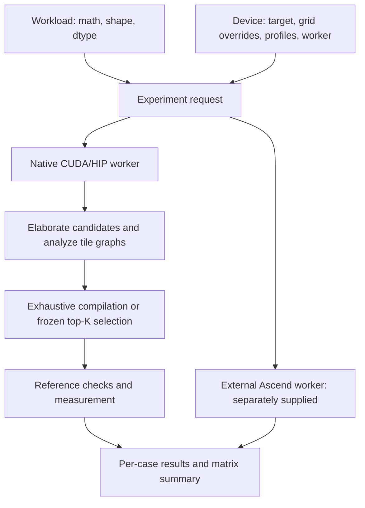

# Shared experiment runner reference

Named family suites now use `study.py`: it collects one immutable baseline bundle
per family/device, then runs only TileTune for each repeat/revision. See the
[baseline reuse and system commands](../README.md#collect-baselines-explicitly-then-run-tiletune).
Reusable helpers live in [`../utils/`](../utils/README.md). The `comparison.py`
commands below describe the lower-level collector; invoke named suites for
automatic reuse across revisions.

To collect only the ten final brute-force baselines on all idle H200 GPUs:

```bash
.agents/skills/tl-conda-gpu-run/scripts/run_in_tl.sh --no-gpu -- \
  python -m experiments.common.brute_force \
  --output experiments/results/h200-expanded-bruteforce
```

This uses the final manifest's family pools, dispatches 64-configuration shards
to matching idle GPUs, and polls compute processes every second. A foreign
process invalidates the affected shard; its timings are discarded and the shard
is retried after an idle GPU becomes available. Process polling cannot rule out
interference shorter than the polling interval. Use `--gpus` to restrict devices
and `--resume` with the same output directory to reuse accepted checkpoints.
Interrupted or GPU-faulted shards are retried in fresh processes; failed
configurations remain in the recorded pool.

The runner writes candidate outcomes, requests, logs, source/build provenance,
GPU observations, and raw oracle tables under the output directory. After each
complete pool, its minimum correct measured latency selects the winner (original
index breaks ties). Seven fresh measurements validate the winner. The matching
record is saved to `experiments/FAMILY/heuristics/H200/WORKLOAD.json` using the
existing A100 heuristic schema, with additional contention and validation paths.

## Configuration spaces

Space version 5 gives each final family exactly one `expanded` pool. Each pool
uses the example's native parameters and includes its original configs/defaults.
The same complete domain is used for both cases and all native targets.

| Family | Configs per case | Example coverage |
| --- | ---: | --- |
| [GEMM](../gemm/README.md) | 2,304 | All 288 autotune configs; 8× expansion |
| [FlashAttention](../flash_attention/README.md) | 320 | Single autotune config and explicit 128/128 launch |
| [KDA chunk output](../kda/README.md) | 720 | All 90 autotune configs; 8× expansion |
| [FP8 GEMM](../gemm_fp8/README.md) | 2,304 | All 288 example schedules; 8× expansion |
| [Grouped GEMM](../grouped_gemm/README.md) | 192 | Fixed 64-row tiles and native example knobs |

Shapes, dtype, causal mode and chunk size are workload properties. They do not
multiply the config count. Full sweeps have no cap, protected subset or
structural prefilter. Every candidate is attempted and actual compilation or
correctness failures are recorded. These counts do not claim that all candidates
compile, pass checks or generate distinct programs. Native target support still
requires device validation.

Explicit CUDA/HIP config lists must select members of the family's pool.
Smoke/development and sampled training budgets retain original pool indices.
`config-space.json` records config hashes and the space version. Config indices
have changed from older presets: keep historical timings with their original
source hashes and pools, and start new runs in new output directories.

GEMM fixes the example's Square/panel-10 defaults. Attention keeps its example's
QK/PV policies, fragment recurrence and causal loop bound. KDA keeps `block_S`
equal to the chunk size. FP8 preserves FP32 accumulation and FP8 output.
Grouped GEMM preserves runtime metadata lookup, padding and group masks.
There are no alternative experiment kernels or supplementary vector families. The shared configuration code accepts only the `expanded` pool.

Inspect a space without loading TileLang or querying hardware:

```bash
python -m experiments.common.run --plan --devices ampere \
  --workloads gemm_square attention_noncausal kda_chunk_regular gemm_fp8_square \
  --config-space expanded
```

Run a checkpointed compilation/correctness census:

```bash
python -m experiments.common.census \
  --device ampere \
  --workloads gemm_square --shard-size 64 --workers 8 --wait-idle \
  --output experiments/results/expanded-census
```

Repeat the exact command with `--resume` to reuse completed shards. Interrupted
shards are preserved and retried in a fresh process. The census reports compile
failures, correctness, distinct generated device-source hashes and best timings
over the declared pool. `current_best_ms` is null for the five family pools,
which no longer have a retained current prefix. Source identity is a
conservative diagnostic; it does not prove binary equivalence. Census compilation
is development/oracle work, not free input to either online tuner.

Run the sampled baseline comparison on the full expanded pools:

```bash
bash experiments/common/run_accelerator.sh \
  --device ampere \
  --workloads gemm_square attention_causal kda_chunk_regular gemm_fp8_square \
  --methods tiletune xgboost --top-k 20 --xgb-sample-fraction 0.1 \
  --wait-idle --output experiments/results/expanded-comparison
```

Training and validation still collect only the seeded 10% subset. The XGBoost
schema recognizes the declared pool's inputs without using unsampled labels.
Its 600-round/depth-10/0.05/0.8 baseline settings and validation early stopping
remain unchanged. Online K is separately capped by
`min(top_k, ceil(pool_size * budget_fraction))`; use `--budget-fraction 1` for
a fixed K up to the pool size. Diagnostics include K=1/5/10/20/50 oracle curves;
these are retrospective evaluations of frozen rankings, not extra online trials.
Choose methods and seeds before collecting test oracles. Report unsupported
TileTune schedules and winner coverage along with latency and selection cost.

Parameter ranges and constraints live in each family’s `spaces.py`.
See [validation](../validation.md) for the checks performed on the organized scripts.

This suite separates the mathematical workload, candidate grid, hardware model,
and execution environment. GEMM, FP8 GEMM, FlashAttention, KDA and grouped GEMM share this
protocol and the same example builders in system and tuner-quality studies.



## Start here

For a complete comparison with disjoint training, validation and test shapes:

```bash
# Use the host compiler and toolkit installed on this server. CUDA 12.4 with
# GCC 9 ignores TileLang's C++20 flag; GCC 10 works on the validated A100 host.
export CUDA_HOME=/path/to/cuda
export CXX=/usr/bin/g++-10
bash experiments/common/run_accelerator.sh --build \
  --device ampere --output experiments/results/a100-comparison --wait-idle
```

`run_accelerator.sh` accepts the arguments of `comparison.py`, including `--manifest`
for another CUDA/HIP accelerator, `--workloads`, `--workers`, and `--plan`.
`CMAKE_COMMAND`, `BUILD_JOBS`, and `PYTHON` can select build/environment tools.
Skip `--build` after rebuilding once. `--resume` verifies the frozen plan,
requests, source hashes and native build before reusing completed cases; use a
new output directory after code changes. The earlier single-method runner below
remains available.

By default, the comparison uses the same ten final cases and the family-owned
two-training/one-validation shape splits as the named suites. A custom
`--manifest` or explicit `--train-scales` / `--validation-scales` / `--test-scales`
selects a scaled-shape study. Missing scale lists then default to training at
0.25× and 0.5×, validation at 0.75×, and held-out tests at 1× and 2×. GEMM scales M/N/K; row kernels scale rows/columns; attention/KDA
scale sequence length while retaining head dimensions. Dimensions round down
to multiples of 32 or the KDA chunk size. Shape aliases and rounding collisions
across any split are rejected. Custom manifests should avoid duplicate semantic
workloads. This is a reproducible shape-generalization study on each measured
device, not evidence of zero-shot transfer between accelerators.

The default online budget per case is `min(20, ceil(grid_size * 0.1))`, so small
six-configuration grids also exercise actual selection. Set `--top-k` and
`--budget-fraction` to change that policy before collection. Every shortlist method uses
the same budget, and all methods use the same grid within a case. Diagnostic Oracle@1/5/10/20 curves are
reported separately; they do not change the online shortlist.

The coordinator prepares fixed primitive profiles first, freezes a seeded 10%
subset of each training/validation pool, and measures only those configurations
with the brute-force worker. Set `--xgb-sample-fraction` to change this collection
budget independently of the online budget. Selection uses configuration inputs
without reading outcomes; failed samples consume budget and are not replaced.
Each request retains the original pool and selected indices. Fitting reuses that
sample without sampling it again. The coordinator fits one XGBoost model per
operation using separate validation shapes and the baseline's WaveTune-derived
defaults: up to 600 rounds, depth 10, learning rate 0.05, and per-round row
subsampling 0.8, with validation patience 20. The frozen plan records these
training settings separately from config-pool sampling and online budgets.
It executes
TileTune `pipeline_time`, the separately declared `traffic_waves` diagnostic,
Carver where supported, and XGBoost before collecting each held-out brute-force
oracle. `frozen-rankings.json` records selections and scores before that oracle.
No workload latency anchor or analytical-model fitting is applied. Training
collection and fitting costs remain in the saved model artifacts; profile
preparation and shuffled winner remeasurement are recorded separately.
The older v20 comparison artifacts used full-pool training and validation; their
published results are historical and do not measure this sampled protocol.

`--method brute_force` on the single-method runner measures every supplied
candidate independently of TileTune analysis. The older `exhaustive` method
still means exhaustive **report-only TileTune** analysis/measurement. The new
Carver adapters accept the example's plain FP16/BF16 GEMM and attention workloads,
and map the exact supplied grid to the existing policies. The attention adapter
uses the unchanged `FlashAttentionTemplate` graph and records its omitted softmax,
causal work and streamed-KV behavior. Rejection of the entire pool produces
`model_unavailable` with all candidate records, no replacement shortlist, and N/A
Oracle@K; reusable baseline bundles retain this outcome. The original Carver
model does not support Blackwell; its adapter records `unsupported` before GPU
execution, allowing other methods to proceed. FP8 reuses MatmulTemplate; grouped
GEMM and chunk KDA use new mathematical templates with the original policy
equations. See [model contracts](../model_contracts.md) for their feasibility
limits and approximations.

Each test case records method outcomes, an independent oracle table, ranking
diagnostics, and repeated winner measurements in `comparison.json`. Diagnostics
retain unknown and pressure-rejected candidates, coverage, ties, Spearman
correlation on scored successful pairs, absolute prediction errors where the
model supplies latency estimates, pipeline unknown reasons, stage-level measured
best times, and seeded random-shortlist Oracle@K comparisons. An unscored oracle
winner remains visible. Report rank correlation together with coverage: strong
correlation on a small scored subset does not establish a useful full-grid model.

The coordinator checks other CUDA compute processes at measurement boundaries.
`--wait-idle` waits for those processes to finish; it never stops them.
`--allow-contended` explicitly permits loaded-GPU protocol checks and records
that choice in the plan. Such timings cannot establish isolated performance or
prediction calibration. Record output stability from the repeated validation
samples, and obtain additional workload distributions before claiming absence
of overfitting. Other runtimes need their scheduler to provide exclusive access.
External Ascend workers retain their explicit execution boundary and must supply
their own winner-remeasurement implementation.

Planning uses only the Python standard library and requires no GPU or TileLang
installation:

```bash
python -m experiments.common.run --plan --smoke
```

Run a small correctness/runner check on a Hopper machine:

```bash
.agents/skills/tl-conda-gpu-run/scripts/run_in_tl.sh -- \
  python -m experiments.common.run \
    --devices hopper --smoke --method exhaustive --config-indices 0 \
    --workloads gemm_square attention_noncausal kda_chunk_regular gemm_fp8_square
```

Run top-K selection over each workload's full default grid:

```bash
python -m experiments.common.run --devices hopper --method top_k --top-k 20
```

`--smoke` selects the ten family-owned development cases, preserving the grid. `--config-indices` explicitly
selects a subset and retains original indices. Remove that argument for full-grid
experiments. The default method is `analyze`; it performs no compilation,
benchmarking, or device-limit query. Supply device limits in a manifest to obtain
occupancy-dependent scores offline.

Every case executes in a fresh process, with its own accelerator context and
`--case-timeout` deadline. A timed-out worker and its local child processes are
killed. Each matrix entry receives a result even if a previous kernel failed.
Compilation/benchmark timing excludes process startup and reference generation;
`worker_wall_seconds` includes the worker's whole lifetime.

## Workloads

The standalone shared runner uses the same ten FP16/FP8 final cases as the family
suites. BF16 and supported boundary shapes can be supplied explicitly for
correctness checks; they do not add default experiment cases:

| Workload | Covered behavior |
| --- | --- |
| `gemm_square`, `gemm_square_large` | 4096³ and 8192³, pretransposed B, FP32 accumulation |
| `attention_noncausal`, `attention_causal` | BSHD online attention with the example causal bounds |
| `kda_chunk_regular`, `kda_chunk_tails` | Chunk output with equal and unequal head dimensions |
| `gemm_fp8_square`, `gemm_fp8_square_large` | FP8 operands/output with FP32 accumulation |
| `grouped_gemm_aligned`, `grouped_gemm_ragged` | Packed groups with runtime metadata and masked stores |

Each family's `kernel.py` and `reference.py` supply its builder,
input generator, reference, output indices, and correctness contract.
`common/kernels.py` dispatches to those family interfaces.
Inputs use a fixed local generator. References compute in
FP32 before the specified output cast. Checks include both elementwise tolerance
and a relative output-norm bound: all-zero output cannot pass solely because a
long-sequence softmax or attention result has small magnitude.

The chunk-output workload calls `examples/kda/chunk_o.py` directly. Inputs and
outputs use BSHD; hidden states use (B,chunks,H,DK,DV). It computes
`cast(cast(q * scale) * exp2(g)) @ hidden + tril(a) @ v`, preserving both
input-dtype rounding points in the example. This is the chunk-output stage,
not the complete KDA forward/backward computation. Its config keys are
`block_DK`, `block_DV`, `num_stages` and `threads`; `block_S` equals chunk size.
The recurrent baseline and old tiled implementation are retired from the suite.

The numerical tests in `test_example_kernels.py`, `test_expanded_kernels.py`
and `test_kda_example.py` check program identity, final shapes, causal masking,
normalization tails and independent PyTorch references.

## Hardware coverage and limits

The preset architectures are examples. Use an explicit manifest for the actual
chip and compiler target; a Blackwell device need not be `sm_100a`, and a 910B
must identify itself as such. A run refuses to substitute a different visible
architecture. Reports include the actual device name and runtime version.

| Target | Execution code | Current timing model |
| --- | --- | --- |
| Ampere | Native CUDA + `tvm_ffi` | MMA and asynchronous-copy probes; compiler-ordered software pipelines use `pipeline_time` |
| Hopper | Native CUDA + `tvm_ffi` | Instruction-specific MMA/WGMMA rates, supported pure-TMA pipelines and metadata-resolved serial regions |
| Blackwell | Native CUDA + `tvm_ffi`, regular `T.gemm`/MMA path | Explicit MMA/synchronous-copy profiling; TCGEN05/TMEM and Blackwell warp-specialized schedules need separate models |
| MI308 | Native HIP + `tvm_ffi` in a ROCm build | Traffic/waves with supplied or queried CU capacities; timing needs a measured HIP profile and supported schedule |
| Huawei 910 | External worker contract | An Ascend worker and Cube/Vector/L0/L1/UB resource/schedule model must be provided |

This checkout does **not** contain the Huawei compiler backend. The upstream
[TileLang-Ascend project](https://github.com/tile-ai/tilelang-ascend) uses its own
compiler/runtime environment. Merely naming `ascend910` does not enable NPU
execution: it produces an explicit `unsupported` result until a worker is
configured. The shared protocol can launch that worker without importing its
incompatible TVM libraries into the CUDA/HIP process.

The [A100 evaluation](../../docs/tiletune_ampere_evaluation.md) records Ampere
runtime results for analysis version 18. The [Ampere pipeline revision](../../docs/tiletune_ampere_pipeline.md)
documents version 20, its compiler-plan checks and the fresh comparison. The
earlier H200 validation does not establish runtime behavior on Blackwell.
MI308 and Huawei execution still need their respective machines and toolchains.

The completed version-20 A100 run covers 34 supported fresh test cases, with four
FP8 cases explicitly unsupported. Pipeline-score shortlists retain 98.31% of
exhaustive-best performance overall. The linked report also records latency
miscalibration, register-gate coverage losses, chunk-KDA ranking failures, and
the cases where analysis costs more than exhaustive tuning.

Those historical runs used explicit FNUZ dtypes for MI308 FP8. The current
FP8 family uses E4M3FN/E5M2 and needs separate HIP validation. HIP compiler remarks retain VGPR, AGPR and SGPR counts separately.
Symbolic or absent counters stay unknown; register spill counts are not converted
to byte counts. On CDNA3, the generic register count is available only when both
architectural VGPR and AGPR observations are numeric. Occupancy remains a logical
tile-storage proxy: SGPR constraints and allocation granularity per SIMD are not
yet modeled.

## Manifests and reusable measurements

A manifest contains `version`, `devices`, and `workloads`. For example:

```json
{
  "version": 1,
  "devices": [
    {
      "name": "h200",
      "target": {"kind": "cuda", "arch": "sm_90a"},
      "profiles": {"float16": "../profiles/h200.json"}
    }
  ],
  "workloads": [
    {
      "name": "gemm_rectangular",
      "op": "gemm",
      "dtype": "float16",
      "parameters": {"m": 4096, "n": 1024, "k": 2048, "transpose_b": true}
    }
  ]
}
```

```bash
python -m experiments.common.run --manifest suite.json \
  --method top_k --metric pipeline_time --top-k 20
```

Profile paths resolve relative to the manifest. A dtype maps to a reusable bundle
created by `tilelang.tiletune.profile_device`; multiple dtypes may share a bundle
that contains all their matrix measurements. Preparation is explicit and occurs
before candidate timing. `--memory-regime` selects cached or streaming rates.
For an externally measured device, use the same bundle schema with explicit
`identity.backend`, `identity.target_arch`, `identity.matrix_instruction`,
device name, and compute-unit count. HIP matrix instruction keys use
`rocm.mfma`; the target kind and profile backend use `hip`.

`performance_model` can instead supply the validated rate dictionary directly.
This supports controlled analytical experiments, including clearly labeled
illustrative rates. It cannot be combined with `profiles`. A timing profile must
match the instruction, dtypes and target; non-CUDA timing also requires an
explicit matching `profile_backend`. Missing measurements produce unknown scores.
A missing dtype in `profiles` produces `model_unavailable` for top-K timing
selection. Exhaustive measurement and analysis remain available with unknown
timing scores; traffic ranking can proceed without that irrelevant profile.

Candidate grids may be specified on a workload with `configs`. A device can
override them by workload name, for example
`"configs": {"gemm_rectangular": [{"block_m": 128, "block_n": 256, "k_l1": 64}]}`
for an external worker that implements those knobs. Device overrides take
precedence over workload grids and defaults, while tensor shapes, dtypes and
reference semantics remain in the shared workload. `--devices` also filters
custom names from a manifest.

Device capacities can be supplied in `device_limits`. For compatibility, existing
field names such as `sm_count`, `registers_per_sm` and `shared_memory_per_sm` also
name the corresponding HIP CU capacities. They must describe the **same execution
unit**. Do not fill missing fields using another device or fabricated defaults.

## External workers

A device entry may provide:

```json
{
  "name": "ascend910b",
  "target": {"kind": "ascendc", "arch": "Ascend910B"},
  "worker": ["/path/to/npu-environment/bin/python", "/path/to/910_worker.py"],
  "worker_cwd": "/path/to/tilelang-ascend"
}
```

This is an interface example; `910_worker.py` is not supplied by this checkout.
The coordinator invokes the argv directly, appending absolute request and result
paths. It performs no shell interpolation or automatic remote connection. An SSH
or scheduler wrapper can be supplied explicitly; it must arrange access to those
files and clean up remote jobs when terminated.

`request.json` contains version 1, a SHA-256 `request_id`, the complete workload
and device descriptions, and settings including method, grid subset, top-K,
metric, seed, workers, and timing budgets. Explicit candidate grids can be given
as the workload's `configs` list or the device's per-workload overrides. The worker owns target-specific kernel
construction, analysis/profiling and execution.

The result must carry the same version, request ID, workload name and device
name. A completed result needs a finite positive winner latency, passed
correctness, and an actual device observation matching the requested target.
Unsupported work must include a reason. See `validate_request`, `validate_result`
and `worker_main` in `run.py`; the built-in CUDA/HIP worker uses this same protocol.

## Results and interpretation

The optional [XGBoost baseline](../xgboost/README.md) accepts
`--method xgboost --xgb-model MODEL --top-k K`. It uses a separately trained model
with explicit workload holdouts and configuration features. Its predictions are
independent of TileTune's analytical features and primitive profiles. Reports
use `xgboost.json` and `outcomes.json`; scores have units `log(ms)`. The model
fingerprint is frozen in the worker request. The native CUDA/HIP worker executes
this method; an external worker must implement it explicitly to use it on Ascend.

Each invocation creates a fresh timestamped output directory. Each device/workload
case writes `request.json`, `result.json`, and `worker.log`. Native runs additionally
write `experiment.json` with source/profile provenance, `tiletune.json` with all
candidate records, and benchmark/timing TSVs when applicable. Exceptions retain
`error.log`. The root `summary.json` includes every attempted case.

Statuses distinguish `analyzed`, `completed`, `unsupported`, `unavailable`,
`model_unavailable` (no eligible top-K scores), and `failed`. Unknown scores are
not measured failures, and a worker executing successfully is not proof of a
correct performance model.

`exhaustive` uses TileTune report-only mode with no cutoff. `top_k` freezes its
selection before compilation, excludes unscored/pressure-rejected candidates,
and never replaces failed selected candidates. The metric is fixed for the run;
there is no fallback between cycle and byte-wave scores. Existing dedicated
comparison runners provide shuffled winner remeasurement and Oracle@K metrics.

The reading path is `spec.py` → `kernels.py` → `run.py`, followed by
`tilelang/tiletune/targets.py` → `analysis.py` → `engine.py`. Family recognition
continues to describe semantic roles; target selection controls hardware rules.
Generic graphs select a recurrence loop only when it is unambiguous. A single-pass
tile uses zero recurrence steps and charges its work once outside the loop.
Ampere `pipeline_time` represents direct scalar global reads and stores at their
per-iteration phase. Other timing paths retain the conservative unknown guard;
complete input regions can still support traffic ranking. Explicit scalar thread indexing also
stays unscored where per-CTA lane coverage is unresolved.

Analysis version 18 adds target-model metadata, heterogeneous runtime integration,
subgroup-aware reduction counting, generic loop/single-pass scheduling, and
preserves launch domains when propagating scalar input regions. Family-specific
CUDA GEMM/attention analysis and the common top-K interface remain in use.

Analysis version 20 adds Ampere compiler-ordered pipeline timing, generic
reduction ownership, per-iteration external accesses and MMA operand storage.
It corrects scalar work counts, per-thread expression reuse and per-output reduction synchronization, and uses profile version 5 for asynchronous-copy
and `rsqrt` service. The default metric is `pipeline_time`; lower scores rank
first. Supply a matching timing profile, or select `--metric traffic_waves`
explicitly for traffic-based ranking. Old profiles without the required
asynchronous-copy fields cannot score positive-stage Ampere pipelines.

For a completed comparison or suite run, [audit_model.py](audit_model.py) audits all saved
TileTune test reports against the independent brute-force outcomes without GPU
execution. It records exclusion reasons, coverage versus ranking loss, scalar
work domains, and available compiler-register comparisons. Reasons overlap and
compiler comparisons cover only candidates whose counters were recorded.

```bash
python -m experiments.common.audit_model experiments/results/your-run \
  --output /tmp/model-audit.json
```

Each new case's `comparison.json` records its oracle path and hash, so audits
support nested seed/target directories and a shared oracle. For an archived case
without this reference, supply `--report PATH/tiletune.json --oracle PATH/outcomes.json`
along with the root directory. Audit and top-K comparison share the same result
reader and Oracle@K calculation in `utils/results.py`.

Use a new output filename. See the [A100 model audit](../../docs/tiletune_model_audit.md)
for the observed defects and architecture coverage requirements.

The suite coordinator keeps baseline bundles separate from new TileTune runs.
It replaces the retired repair-study runner and its stale manifests.
Custom ablations can use `comparison.py --split-manifest` with explicit current
workloads and `--methods`; the named suites retain their fixed study protocol.

## Compact five-target suites

`python -m experiments.suite --suite smoke --plan` plans five families
with deterministic subsets. Development uses ten cases and up to 256
configurations; final uses the complete `expanded` pools (GEMM 2,304,
FlashAttention 320, KDA 720, FP8 GEMM 2,304 and grouped GEMM 192 per case) and three seeds. See
[validation](../validation.md) for
commands, verified behavior, and the incomplete native-device milestones.

GEMM uses regular square matrices with M=N=K and pretransposed B=(N,K):

| Case | Development | Final |
| --- | ---: | ---: |
| `gemm_square` | 1024 | 4096 |
| `gemm_square_large` | 2048 | 8192 |

Smoke uses the 1024-square case. The final dimensions are recorded in
[`five_target_final.json`](../manifests/five_target_final.json).

Analysis version 23 accepts verified read-only integer `input_values`, resolves
metadata-dependent addresses without rewriting the executable, and preserves
actual loads and masked stores. Profile version 6 measures both MMA and WGMMA on
Hopper and selects rates by exact instruction and dtype. See
[model contracts](../model_contracts.md) for the distinction between exact work
counts, estimated latency and unsupported scheduling.
