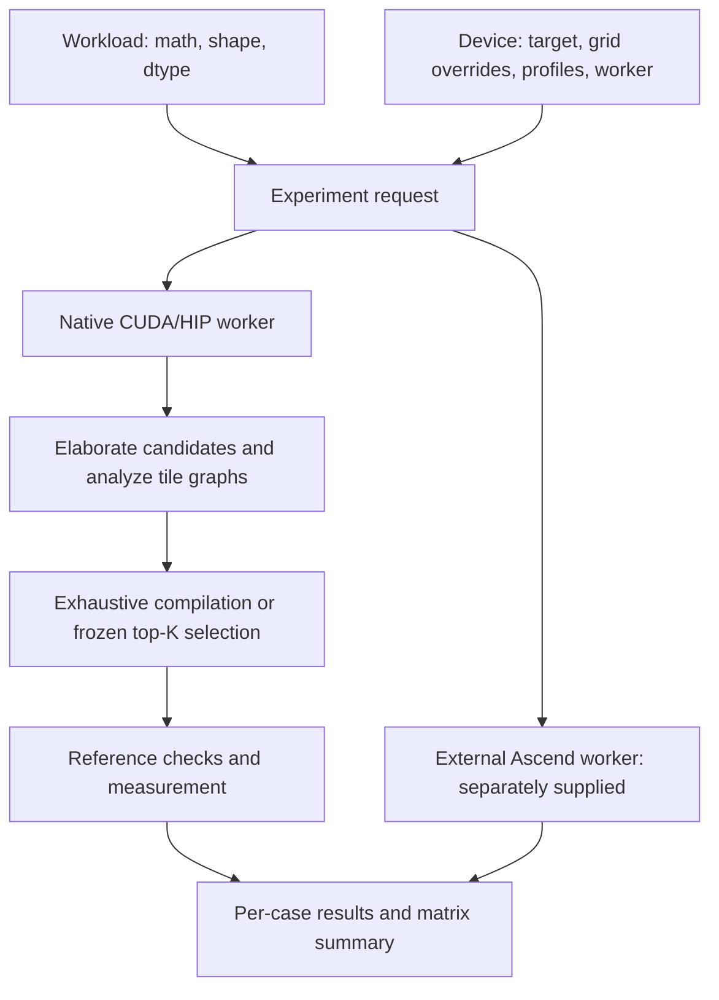

# Portable TileTune experiments

This suite separates the mathematical workload, candidate grid, hardware model,
and execution environment. It adds GEMM variants, FlashAttention, KDA and
representative reduction/elementwise workloads to one experiment matrix. The
existing `experiments/{gemm,gemm_fp8,flash_attention}/` comparisons remain useful
for their fixed-grid Carver comparisons and system-optimization studies.



## Start here

For a complete comparison with disjoint training, validation and test shapes:

```bash
# Use the host compiler and toolkit installed on this server. CUDA 12.4 with
# GCC 9 ignores TileLang's C++20 flag; GCC 10 works on the validated A100 host.
export CUDA_HOME=/path/to/cuda
export CXX=/usr/bin/g++-10
bash experiments/portable/run_accelerator.sh --build \
  --device ampere --output experiments/results/a100-comparison --wait-idle
```

`run_accelerator.sh` accepts the arguments of `compare.py`, including `--manifest`
for another CUDA/HIP accelerator, `--workloads`, `--workers`, and `--plan`.
`CMAKE_COMMAND`, `BUILD_JOBS`, and `PYTHON` can select build/environment tools.
Skip `--build` after rebuilding once. `--resume` verifies the frozen plan,
requests, source hashes and native build before reusing completed cases; use a
new output directory after code changes. The earlier single-method runner below
remains available.

The comparison uses the original grids and scales mathematical shapes before
measurement: training at 0.25× and 0.5×, validation at 0.75×, and held-out tests
at 1× and 2×. GEMM scales M/N/K; row kernels scale rows/columns; attention/KDA
scale sequence length while retaining head dimensions. Dimensions round down
to multiples of 32 or the KDA chunk size. Shape aliases and rounding collisions
across any split are rejected. Custom manifests should avoid duplicate semantic
workloads. This is a reproducible shape-generalization study on each measured
device, not evidence of zero-shot transfer between accelerators.

The default online budget per case is `min(20, ceil(grid_size * 0.1))`, so small
six-configuration grids also exercise actual selection. Set `--top-k` and
`--budget-fraction` to change that policy before collection. Every shortlist method uses
the same budget, and all methods use the same grid within a case. Diagnostic Oracle@1/5/10/20 curves are
reported separately; they do not change the online shortlist.

The coordinator prepares fixed primitive profiles first, collects independent
brute-force training/validation runs, and fits one XGBoost model per operation
using the baseline's fixed defaults and validation early stopping. It executes
TileTune `pipeline_time`, the separately declared `traffic_waves` diagnostic,
Carver where supported, and XGBoost before collecting each held-out brute-force
oracle. `frozen-rankings.json` records selections and scores before that oracle.
No workload latency anchor or analytical-model fitting is applied. Training
collection and fitting costs remain in the saved model artifacts; profile
preparation and shuffled winner remeasurement are recorded separately.

`--method brute_force` on the single-method runner measures every supplied
candidate independently of TileTune analysis. The older `exhaustive` method
still means exhaustive **report-only TileTune** analysis/measurement. The new
Carver adapter accepts plain, nonbatched FP16/BF16 GEMMs, including transpose
variants, and maps the exact supplied grid to the existing policy. It reports
unsupported for fused/batched GEMMs and other operations. CUDA FP8 and AMD FNUZ
remain explicit hardware-dependent cases; Ampere FP8 is unsupported.

Each test case records method outcomes, an independent oracle table, ranking
diagnostics, and repeated winner measurements in `comparison.json`. Diagnostics
retain unknown and pressure-rejected candidates, coverage, ties, Spearman
correlation on scored successful pairs, absolute prediction errors where the
model supplies latency estimates, pipeline unknown reasons, stage-level measured
best times, and seeded random-shortlist Oracle@K comparisons. An unscored oracle
winner remains visible. Report rank correlation together with coverage: strong
correlation on a small scored subset does not establish a useful full-grid model.

The coordinator checks other CUDA compute processes at measurement boundaries.
`--wait-idle` waits for those processes to finish; it never stops them.
`--allow-contended` explicitly permits loaded-GPU protocol checks and records
that choice in the plan. Such timings cannot establish isolated performance or
prediction calibration. Record output stability from the repeated validation
samples, and obtain additional workload distributions before claiming absence
of overfitting. Other runtimes need their scheduler to provide exclusive access.
External Ascend workers retain their explicit execution boundary and must supply
their own winner-remeasurement implementation.

Planning uses only the Python standard library and requires no GPU or TileLang
installation:

```bash
python -m experiments.portable.run --plan --smoke
```

Run a small correctness/runner check on a Hopper machine:

```bash
.agents/skills/tl-conda-gpu-run/scripts/run_in_tl.sh -- \
  python -m experiments.portable.run \
    --devices hopper --smoke --method exhaustive --config-indices 0 \
    --workloads gemm_nn gemm_batched gemm_bias_relu flashattention \
                flashattention_bf16 kda_recurrent kda_chunk_o softmax rmsnorm
```

Run top-K selection over each workload's full default grid:

```bash
python -m experiments.portable.run --devices hopper --method top_k --top-k 20
```

`--smoke` reduces problem sizes, preserving the grid. `--config-indices` explicitly
selects a subset and retains original indices. Remove that argument for full-grid
experiments. The default method is `analyze`; it performs no compilation,
benchmarking, or device-limit query. Supply device limits in a manifest to obtain
occupancy-dependent scores offline.

Every case executes in a fresh process, with its own accelerator context and
`--case-timeout` deadline. A timed-out worker and its local child processes are
killed. Each matrix entry receives a result even if a previous kernel failed.
Compilation/benchmark timing excludes process startup and reference generation;
`worker_wall_seconds` includes the worker's whole lifetime.

## Workloads

The default suite contains:

| Workload | Covered behavior |
| --- | --- |
| `gemm_nn`, `gemm_nt`, `gemm_tn` | Input transpose combinations |
| `gemm_batched` | Strided batched matrix multiplication |
| `gemm_bias_relu` | Fused bias and activation epilogue |
| `gemm_bf16` | BF16 operands with FP32 accumulation |
| `gemm_fp8`, `gemm_fp8_fnuz` | Explicit CUDA and AMD FP8 formats; FP16 output |
| `gemm_tall`, `gemm_wide` | Unequal tile counts and matrix aspect ratios |
| `flashattention`, `flashattention_causal`, `flashattention_bf16` | Stable online softmax and two connected matrix operations |
| `kda_recurrent` | Complete recurrent forward baseline with a live state and per-key gates |
| `kda_chunk_o` | Gated-query/state GEMM plus causal intra-chunk output GEMM |
| `softmax`, `rmsnorm`, `reduce_sum`, `elementwise` | Reduction, normalization, broadcast, and single-pass tile graphs |

`kernels.py` owns each builder, input generator, reference, output indices and
correctness contract. Inputs use a fixed local generator. References compute in
FP32 before the specified output cast. Checks include both elementwise tolerance
and a relative output-norm bound: all-zero output cannot pass solely because a
long-sequence softmax or attention result has small magnitude.

The recurrent KDA baseline starts from zero state. For each token:

```text
H_decay = exp(g_t)[:, None] * H_previous
delta   = beta_t * (v_t - k_t @ H_decay)
H_t     = H_decay + k_t[:, None] * delta[None, :]
o_t     = (q_t / sqrt(key_dim)) @ H_t
```

It returns the output sequence and final FP32 state. Its tensor layout is BHSD.
The chunk-output workload uses cumulative base-two gates and computes
`cast(q * scale * exp2(g)) @ hidden + tril(a) @ v` per chunk, matching the
materialized intermediate dtype. This is one stage of chunked KDA, not an
optimized end-to-end chunked implementation or a backward pass. The existing
`examples/kda/` contains additional forward/backward kernels for future adapters.

## Hardware coverage and limits

The preset architectures are examples. Use an explicit manifest for the actual
chip and compiler target; a Blackwell device need not be `sm_100a`, and a 910B
must identify itself as such. A run refuses to substitute a different visible
architecture. Reports include the actual device name and runtime version.

| Target | Execution code | Current timing model |
| --- | --- | --- |
| Ampere | Native CUDA + `tvm_ffi` | MMA and asynchronous-copy probes; compiler-ordered software pipelines use `pipeline_time` |
| Hopper | Native CUDA + `tvm_ffi` | WGMMA, supported pure-TMA producer pipelines and existing primitive profiles |
| Blackwell | Native CUDA + `tvm_ffi`, regular `T.gemm`/MMA path | Explicit MMA/synchronous-copy profiling; TCGEN05/TMEM and Blackwell warp-specialized schedules need separate models |
| MI308 | Native HIP + `tvm_ffi` in a ROCm build | Traffic/waves with supplied or queried CU capacities; timing needs a measured HIP profile and supported schedule |
| Huawei 910 | External worker contract | An Ascend worker and Cube/Vector/L0/L1/UB resource/schedule model must be provided |

This checkout does **not** contain the Huawei compiler backend. The upstream
[TileLang-Ascend project](https://github.com/tile-ai/tilelang-ascend) uses its own
compiler/runtime environment. Merely naming `ascend910` does not enable NPU
execution: it produces an explicit `unsupported` result until a worker is
configured. The shared protocol can launch that worker without importing its
incompatible TVM libraries into the CUDA/HIP process.

The [A100 evaluation](../../docs/tiletune_ampere_evaluation.md) records Ampere
runtime results for analysis version 18. The [Ampere pipeline revision](../../docs/tiletune_ampere_pipeline.md)
documents version 20, its compiler-plan checks and the fresh comparison. The
earlier H200 validation does not establish runtime behavior on Blackwell.
MI308 and Huawei execution still need their respective machines and toolchains.

The completed version-20 A100 run covers 34 supported fresh test cases, with four
FP8 cases explicitly unsupported. Pipeline-score shortlists retain 98.31% of
exhaustive-best performance overall. The linked report also records latency
miscalibration, register-gate coverage losses, chunk-KDA ranking failures, and
the cases where analysis costs more than exhaustive tuning.

MI308 FP8 uses explicit FNUZ dtypes rather than silently changing CUDA FN/E5M2
inputs. HIP compiler remarks retain VGPR, AGPR and SGPR counts separately.
Symbolic or absent counters stay unknown; register spill counts are not converted
to byte counts. On CDNA3, the generic register count is available only when both
architectural VGPR and AGPR observations are numeric. Occupancy remains a logical
tile-storage proxy: SGPR constraints and allocation granularity per SIMD are not
yet modeled.

## Manifests and reusable measurements

A manifest contains `version`, `devices`, and `workloads`. For example:

```json
{
  "version": 1,
  "devices": [
    {
      "name": "h200",
      "target": {"kind": "cuda", "arch": "sm_90a"},
      "profiles": {"float16": "../profiles/h200.json"}
    }
  ],
  "workloads": [
    {
      "name": "gemm_rectangular",
      "op": "gemm",
      "dtype": "float16",
      "parameters": {"m": 4096, "n": 1024, "k": 2048, "transpose_b": true}
    }
  ]
}
```

```bash
python -m experiments.portable.run --manifest suite.json \
  --method top_k --metric pipeline_time --top-k 20
```

Profile paths resolve relative to the manifest. A dtype maps to a reusable bundle
created by `tilelang.tiletune.profile_device`; multiple dtypes may share a bundle
that contains all their matrix measurements. Preparation is explicit and occurs
before candidate timing. `--memory-regime` selects cached or streaming rates.
For an externally measured device, use the same bundle schema with explicit
`identity.backend`, `identity.target_arch`, `identity.matrix_instruction`,
device name, and compute-unit count. HIP matrix instruction keys use
`rocm.mfma`; the target kind and profile backend use `hip`.

`performance_model` can instead supply the validated rate dictionary directly.
This supports controlled analytical experiments, including clearly labeled
illustrative rates. It cannot be combined with `profiles`. A timing profile must
match the instruction, dtypes and target; non-CUDA timing also requires an
explicit matching `profile_backend`. Missing measurements produce unknown scores.
A missing dtype in `profiles` produces `model_unavailable` for top-K timing
selection. Exhaustive measurement and analysis remain available with unknown
timing scores; traffic ranking can proceed without that irrelevant profile.

Candidate grids may be specified on a workload with `configs`. A device can
override them by workload name, for example
`"configs": {"gemm_rectangular": [{"block_m": 128, "block_n": 256, "k_l1": 64}]}`
for an external worker that implements those knobs. Device overrides take
precedence over workload grids and defaults, while tensor shapes, dtypes and
reference semantics remain in the shared workload. `--devices` also filters
custom names from a manifest.

Device capacities can be supplied in `device_limits`. For compatibility, existing
field names such as `sm_count`, `registers_per_sm` and `shared_memory_per_sm` also
name the corresponding HIP CU capacities. They must describe the **same execution
unit**. Do not fill missing fields using another device or fabricated defaults.

## External workers

A device entry may provide:

```json
{
  "name": "ascend910b",
  "target": {"kind": "ascendc", "arch": "Ascend910B"},
  "worker": ["/path/to/npu-environment/bin/python", "/path/to/910_worker.py"],
  "worker_cwd": "/path/to/tilelang-ascend"
}
```

This is an interface example; `910_worker.py` is not supplied by this checkout.
The coordinator invokes the argv directly, appending absolute request and result
paths. It performs no shell interpolation or automatic remote connection. An SSH
or scheduler wrapper can be supplied explicitly; it must arrange access to those
files and clean up remote jobs when terminated.

`request.json` contains version 1, a SHA-256 `request_id`, the complete workload
and device descriptions, and settings including method, grid subset, top-K,
metric, seed, workers, and timing budgets. Explicit candidate grids can be given
as the workload's `configs` list or the device's per-workload overrides. The worker owns target-specific kernel
construction, analysis/profiling and execution.

The result must carry the same version, request ID, workload name and device
name. A completed result needs a finite positive winner latency, passed
correctness, and an actual device observation matching the requested target.
Unsupported work must include a reason. See `validate_request`, `validate_result`
and `worker_main` in `run.py`; the built-in CUDA/HIP worker uses this same protocol.

## Results and interpretation

The optional [XGBoost baseline](../xgboost/README.md) accepts
`--method xgboost --xgb-model MODEL --top-k K`. It uses a separately trained model
with explicit workload holdouts and configuration features. Its predictions are
independent of TileTune's analytical features and primitive profiles. Reports
use `xgboost.json` and `outcomes.json`; scores have units `log(ms)`. The model
fingerprint is frozen in the worker request. The native CUDA/HIP worker executes
this method; an external worker must implement it explicitly to use it on Ascend.

Each invocation creates a fresh timestamped output directory. Each device/workload
case writes `request.json`, `result.json`, and `worker.log`. Native runs additionally
write `experiment.json` with source/profile provenance, `tiletune.json` with all
candidate records, and benchmark/timing TSVs when applicable. Exceptions retain
`error.log`. The root `summary.json` includes every attempted case.

Statuses distinguish `analyzed`, `completed`, `unsupported`, `unavailable`,
`model_unavailable` (no eligible top-K scores), and `failed`. Unknown scores are
not measured failures, and a worker executing successfully is not proof of a
correct performance model.

`exhaustive` uses TileTune report-only mode with no cutoff. `top_k` freezes its
selection before compilation, excludes unscored/pressure-rejected candidates,
and never replaces failed selected candidates. The metric is fixed for the run;
there is no fallback between cycle and byte-wave scores. Existing dedicated
comparison runners provide shuffled winner remeasurement and Oracle@K metrics.

The reading path is `spec.py` → `kernels.py` → `run.py`, followed by
`tilelang/tiletune/targets.py` → `analysis.py` → `engine.py`. Family recognition
continues to describe semantic roles; target selection controls hardware rules.
Generic graphs select a recurrence loop only when it is unambiguous. A single-pass
tile uses zero recurrence steps and charges its work once outside the loop.
Ampere `pipeline_time` represents direct scalar global reads and stores at their
per-iteration phase. Other timing paths retain the conservative unknown guard;
complete input regions can still support traffic ranking. Explicit scalar thread indexing also
stays unscored where per-CTA lane coverage is unresolved.

Analysis version 18 adds target-model metadata, heterogeneous runtime integration,
subgroup-aware reduction counting, generic loop/single-pass scheduling, and
preserves launch domains when propagating scalar input regions. Family-specific
CUDA GEMM/attention analysis and the common top-K interface remain in use.

Analysis version 20 adds Ampere compiler-ordered pipeline timing, generic
reduction ownership, per-iteration external accesses and MMA operand storage.
It corrects scalar work counts, per-thread expression reuse and per-output reduction synchronization, and uses profile version 5 for asynchronous-copy
and `rsqrt` service. Select `--metric pipeline_time` for pipeline-score ranking;
lower scores rank first. Old profiles without the required asynchronous-copy
fields cannot score positive-stage Ampere pipelines.

For a completed `compare.py` run, [audit_model.py](audit_model.py) audits all saved
TileTune test reports against the independent brute-force outcomes without GPU
execution. It records exclusion reasons, coverage versus ranking loss, scalar
work domains, and available compiler-register comparisons. Reasons overlap and
compiler comparisons cover only candidates whose counters were recorded.

```bash
python experiments/portable/audit_model.py experiments/results/your-run \
  --output /tmp/model-audit.json
```

Use a new output filename. See the [A100 model audit](../../docs/tiletune_model_audit.md)
for the observed defects and architecture coverage requirements.
